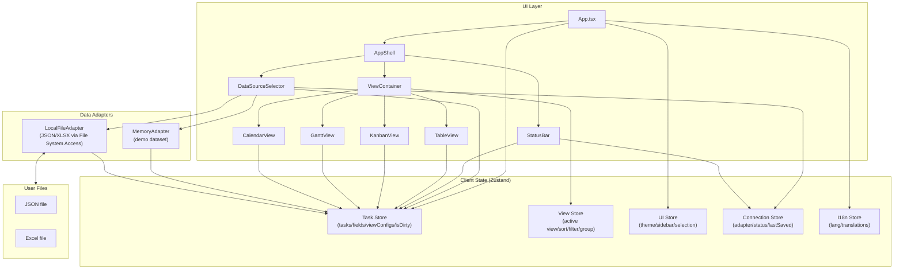
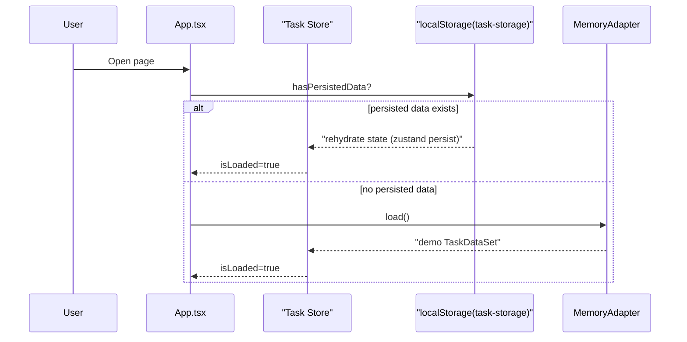
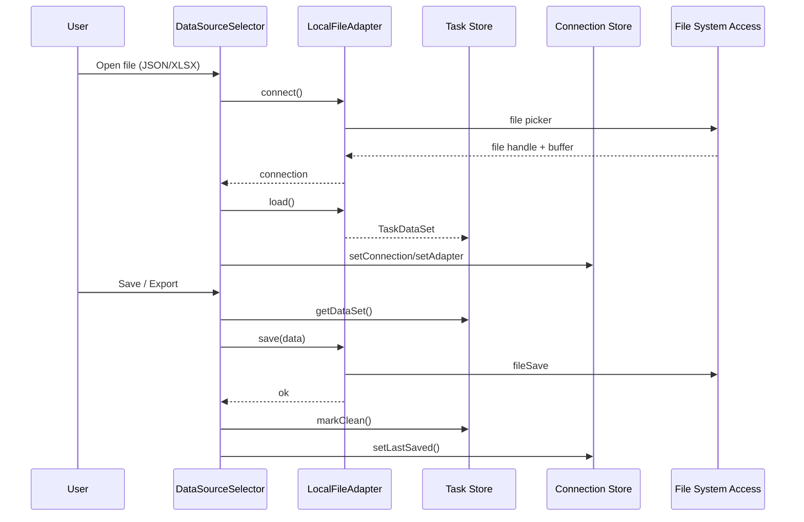
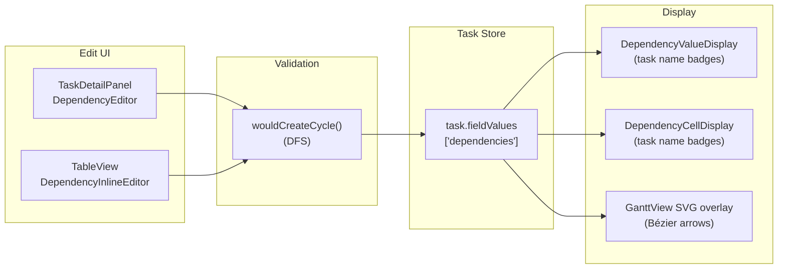

# Task Management Tool Architecture

## Overview
This tool is a fully client-side SPA built with Vite + React. All data stays in the browser (Zustand + localStorage) or in user-selected local files (JSON/XLSX). There is no server-side API or external data transmission.

Key entry points and modules:
- Entry and initialization: src/main.tsx, src/App.tsx
- Main layout: src/components/layout/AppShell.tsx
- View switcher: src/components/views/ViewContainer.tsx
- State stores: src/stores/*
- Data adapters: src/adapters/*
- Data import/export UI: src/components/data-source/DataSourceSelector.tsx
- Validation/sanitization: src/lib/sanitize.ts

## Diagram 1: Component/State/Data Overview

## Diagram 2: App Initialization (Persisted Data vs Demo)

## Diagram 3: File Load/Save Flow

## GitHub Pages: Multi-user Access Considerations
- No shared data: Each user works in their own browser and local files. Data does not mix between users.
- No real-time collaboration: There is no server, so collaborative editing is not supported.
- Shared device risk: On shared PCs, data can remain in localStorage. Users should export files and clear browser data after use.
- Data loss risk: Clearing browser data or using private mode can erase local data. Recommend regular JSON/XLSX exports.
- Import size limit: Imports are capped at 50MB to prevent oversized file loads.

## Task Dependencies (2026-02-11)

The dependencies field (`SYSTEM_FIELD_IDS.DEPENDENCIES`) stores an array of task IDs, enabling structured task-to-task linking.

### Data Model

- Field type: `multi_select` (system field)
- Value: `string[]` of task IDs stored in `task.fieldValues['dependencies']`
- Semantics: Finish-to-Start — the listed tasks are predecessors of the current task

### Utility Module: src/lib/dependency-utils.ts

- `getDependencies(task)` — safely extract dependency IDs from a task
- `buildDependencyGraph(tasks)` — build adjacency list for all tasks
- `wouldCreateCycle(graph, from, to)` — DFS-based cycle detection before adding an edge
- `getAllDependencyEdges(tasks)` — extract all edges for Gantt arrow rendering

### Diagram 4: Dependency Data Flow

### Edit UI

- **TaskDetailPanel**: `DependencyEditor` — dropdown with search filter, task name display, cycle check with toast warning
- **TableView**: `DependencyInlineEditor` — compact inline version of the same editor

### Gantt Arrow Rendering

- SVG overlay layer inserted between task rows and the marquee rectangle
- Each dependency edge draws a cubic Bézier curve from predecessor bar's right edge to successor bar's left edge
- Arrow marker defined via SVG `<marker>` with `<defs>`
- `pointer-events: none` ensures no interference with existing drag/resize/marquee interactions

### Cleanup on Task Deletion

- `deleteTask()` and `deleteTasks()` in task-store automatically remove deleted task IDs from all other tasks' dependency arrays

### Key Files

| File | Role |
| ---- | ---- |
| src/lib/dependency-utils.ts | Core logic (graph, cycle detection, edge extraction) |
| src/stores/task-store.ts | Cleanup on deletion |
| src/components/task/TaskDetailPanel.tsx | DependencyEditor + DependencyValueDisplay |
| src/components/views/table/TableView.tsx | DependencyInlineEditor + DependencyCellDisplay |
| src/components/views/gantt/GanttView.tsx | SVG arrow overlay |

## Security/Privacy Notes
- No network communication APIs (fetch/axios/WebSocket) are used.
- No account login is required; no personal data is collected.
- File access is only via explicit user selection (File System Access API).
- Basic sanitization is implemented for URLs and color values.
